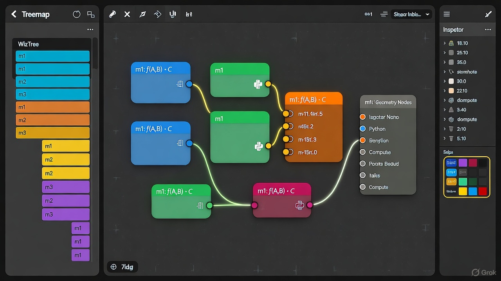

# APT Image Generation — Test 1 (UI Visualizer)

## Abstract
A reformatted, research-style record of the first APT-format image generation experiment (UI visualizer). The APT prompt is presented as a set of indexed modules, variable definitions, and equations, followed by a fused, copy/pasteable natural-language prompt suitable for image generation models.

## APT Modules and Variables

[Module 1] System Goal

- Variables:
  - U = User Interface visualization of APT system
  - V = Visual representation (image)
  - M = Set of modules in the APT system
  - S = Style reference

- Equation:

  V = f(U, M, S)

  (f maps logical APT data to an aesthetic UI mockup.)

[Module 2] Layout Structure

- Variables:
  - L1 = Treemap zone (WizTree-like overview, left 60%)
  - L2 = Node graph zone (Geometry Nodes–like, center 30%)
  - L3 = Inspector panel (right 10%)
  - L4 = Toolbar and breadcrumbs (top 5%)

- Equation:

  Layout = {L1 (left 60%), L2 (center 30%), L3 (right 10%), L4 (top 5%)}

[Module 3] Node Design

- Variables:
  - n_i = Node i (Python, FFmpeg, Transform, File, IO)
  - socket_in, socket_out = Circular ports
  - color(n_i) = Category-based color (Compute=blue, IO=orange, Transform=green, File=purple)
  - label(n_i) = "m1: f(A,B)→C" displayed beneath the node title

- Equation:

  NodeCard(n_i) = {RoundedRect + Sockets + Label + CategoryColor}

[Module 4] Treemap Region

- Variables:
  - Tile_n = rectangular area for module n
  - Area(Tile_n) ∝ complexity
  - Color(Tile_n) = module category
  - Label(Tile_n) = short name (m1, m2, …)

- Equation:

  Treemap = Σ Tile_n over M

[Module 5] Typography & Iconography

- Variables:
  - Font1 = Sans-serif (Inter / SF Pro) for labels
  - Font2 = Monospace (JetBrains Mono) for algebraic text
  - Icon_n = Minimal vector glyph inside each node

- Equation:

  Text(n_i) = combine(Font1(label), Font2(equation))

[Module 6] Lighting & Atmosphere

- Variables:
  - Bg = dark, desaturated neutral tone (#1b1b1b)
  - AccentLight = neon blue/green glow on active nodes
  - Depth = subtle parallax shadows, 2D pseudo-depth

- Equation:

  Aesthetic = synth(Bg, AccentLight, Depth)

[Module 7] Output — Fused Prompt (copy/paste)

A sleek dark-mode software interface visualizing an algebraic modular system. Left: compact treemap view resembling WizTree with colorful rectangular tiles labeled m1, m2, m3. Center: a node graph editor resembling Blender Geometry Nodes with rounded rectangular nodes connected by curved glowing wires. Nodes are color-coded (blue, green, orange, purple) with small circular input/output ports and algebraic labels such as "m1: f(A,B)→C". Minimal vector icons (Python, file, compute) sit inside node cards. Right: a thin inspector panel with module details and color swatches. Top toolbar has breadcrumbs and icons. Overall look: high-tech, clean, mathematically inspired, neon accent lighting on a dark gray background, subtle shadows, and crisp typography (Inter + JetBrains Mono). Render as a realistic UI mockup, 4K resolution, cinematic lighting, flat design with soft depth.

---

### Resulting images (from original experiment)

