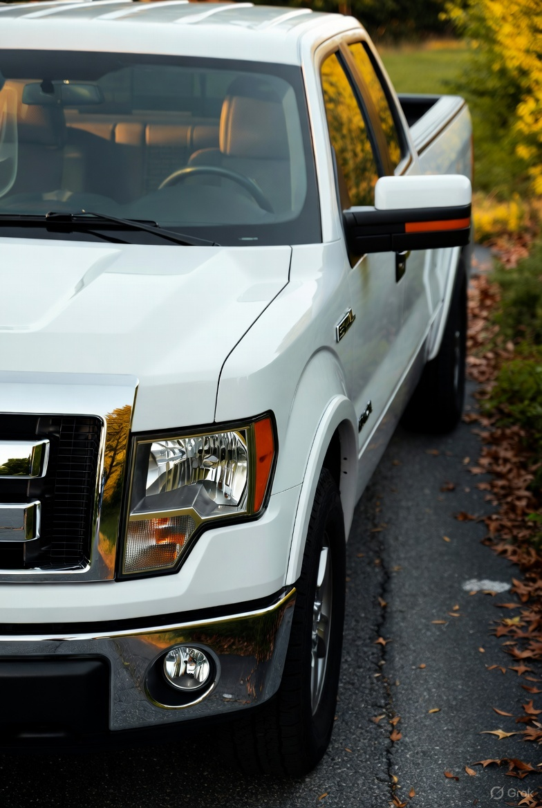
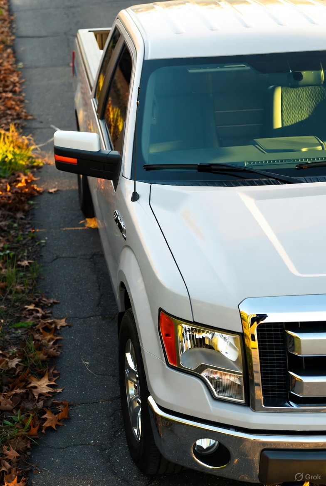

# APT Image Generation — Test 2 (2014 Ford F-150 5.0L)

## Abstract
Reformatted APT prompt and prompt-engineering notes for the photorealistic truck test. Includes a copy/pasteable APT-structured prompt with explicit vehicle specification to maximize fidelity.

## APT Modules and Variables

[Module 1] System Goal

- Variables:
  - T = 2014 Ford F-150, 5.0L V8, white, extended cab
  - V = Viewing angle (45-degree front 3/4)
  - L = Lighting conditions (golden hour sunlight)

- Equation:

  I = f(T, V, L)

[Module 2] Truck Details

- Variables:
  - G = Correct grille (Ford F-150 2014), chrome trim, authentic headlight shape
  - B = F-150 and "5.0L" badging on fender/tailgate
  - W = Factory wheels, appropriate tire brand and profile
  - Int = Textured interior visible through windows (leather, stitching)

- Equation:

  Details = g(G, B, W, Int)

[Module 3] Environmental Context

- Variables:
  - P = Cracked asphalt driveway, scattered autumn leaves, overgrown vegetation at edges
  - Amb = Soft natural shadows and warm rim light from low sun

- Equation:

  Env = h(P, Amb)

[Module 4] Visual Representation — Fused Prompt (copy/paste)

Generate a photorealistic image of a white 2014 Ford F-150 extended cab with the 5.0L V8. Present the truck from a 45-degree front 3/4 angle, clearly showing the authentic 2014 Ford grille and headlight shapes, chrome trim, and visible "5.0L" badging. Include factory-style wheels and realistic tire branding. The truck should be parked on a cracked asphalt driveway with a few scattered autumn leaves and overgrown vegetation at the edges. Warm golden-hour sunlight should illuminate the scene, producing soft shadows and subtle rim highlights on chrome surfaces. Capture interior texture details visible through the windows (leather seats, stitching). Render photorealistically with high resolution and natural camera perspective.

---

### Resulting images (from original experiment)

